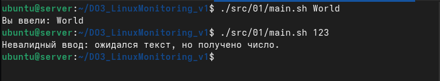
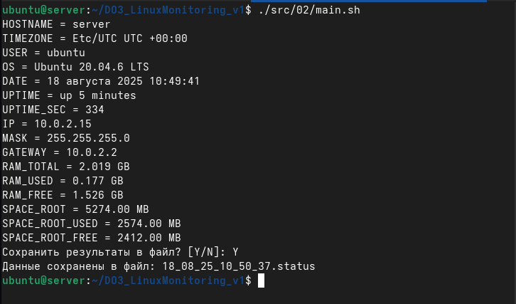
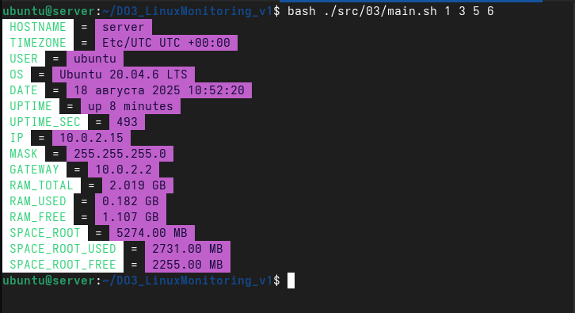
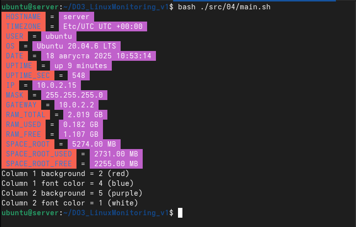
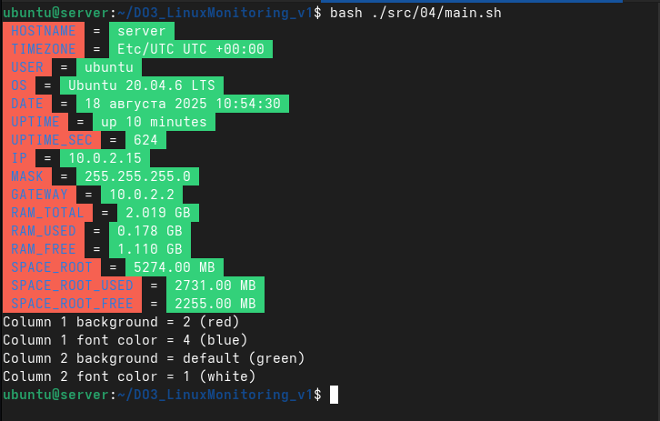
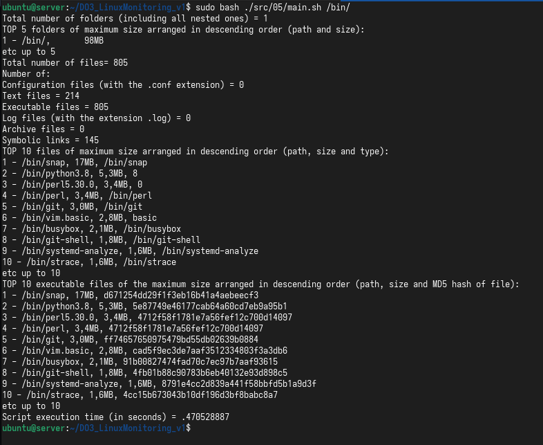

# DO3_LinuxMonitoring_v1
### Проект: набор bash-скриптов для мониторинга Linux.
### Платформа для запуска и тестирования: Linux.

### Содержание репозитория:
```bash
/src
  /01/          # Part 1 — Проба пера
    main.sh
    functions.sh
  /02/          # Part 2 — Исследование системы
    main.sh
    functions.sh
  /03/          # Part 3 — Визуальное оформление (параметры из CLI)
    main.sh
    functions.sh
  /04/          # Part 4 — Конфигурация визуального оформления (config.conf)
    main.sh
    functions.sh
    config.conf (пример)
  /05/          # Part 5 — Исследование файловой системы
    main.sh
    functions.sh
README.md
```
- > Правило проекта: все исполняемые bash-скрипты находятся в src/*; основной скрипт каждого задания называется main.sh. Код разбит/декомпозирован — основная логика в functions.sh, точечное поведение — в main.sh.

#### Общие требования к скриптам

- > #### Запускать на Linux.<br> Все скрипты проверяют входные параметры (количество, формат).<br> Скрипты написаны на bash (shebang: #!/usr/bin/env bash).


## Part 1 — Проба пера (src/01/main.sh)

### Что делает:
- > ### Скрипт принимает один параметр (строковый). Если параметр — число, скрипт сообщает, что ввод некорректен. Иначе выводит значение.

### Пример запуска:



## Part 2 — Исследование системы (src/02/main.sh)

### Что делает: собирает и печатает информацию о системе:

- > HOSTNAME — сетевое имя
<br>TIMEZONE — временная зона (Continent/City) и смещение UTC
<br> USER — пользователь, который запустил скрипт
<br> OS — тип и версия ОС (используется lsb_release или /etc/os-release)
<br> DATE — текущее локальное время, формат: 12 May 2025 12:24:36
<br> UPTIME — человеческое время работы uptime -p
<br> UPTIME_SEC — секунды работы cat /proc/uptime
<br> IP — первый глобальный IPv4 адрес (из ip -4 addr)
<br> MASK — сетевой маскa (в виде 255.255.255.0) — извлекается либо через ipcalc -m, либо путём преобразования префикса
<br> GATEWAY — шлюз по умолчанию ip route
<br> RAM_TOTAL, RAM_USED, RAM_FREE — в ГБ (3 знака)
<br> SPACE_ROOT, SPACE_ROOT_USED, SPACE_ROOT_FREE — для / в МБ (2 знака)

#### После вывода скрипт предлагает сохранить вывод в файл с названием DD_MM_YY_HH_MM_SS.status.

### Пример запуска:


## Part 3 — Цветное оформление вывода (src/03/main.sh)

### Что делает: расширяет Part 2, но выводит строки KEY = VALUE в цвете.
### Скрипт запускается с 4 параметрами — числа от 1 до 6 (обозначение цветов):

### Число	Цвет фона/текста
- > 1	white
<br> 2	red
<br> 3	green
<br> 4	blue
<br> 5	purple
<br> 6	black

### Параметры:
- > фон названий (HOSTNAME, TIMEZONE, ...)
<br> цвет шрифта названий
<br> фон значений (после =)
<br> цвет шрифта значений

### Ограничения:

> #### Фон и цвет шрифта одного столбца не должны совпадать (проверка).

> #### Параметры обязаны быть числами 1..6 (проверка регуляркой). Если один из параметров выходит за диапазон, скрипт завершит работу с сообщением ошибки.

> ### В main.sh заданы массивы bg_colors и fg_colors, которые содержат ANSI escape sequences. Скрипт использует их по индексам в соответствии с параметрами.

### Пример запуска:


## Part 4 — Конфигурация цветовой схемы (src/04/main.sh, config.conf)

### Что делает: то же, что и Part 3, но параметры цвета читаются не из CLI, а из config.conf. Если параметр отсутствует — используется схема по умолчанию (значения переменных DEFAULT_COL*).

### Формат config.conf:
``` text
column1_background=2
column1_font_color=4
column2_background=5
column2_font_color=1
```

### Поведение:

- > #### Скрипт ищет файл config.conf.

- > #### Если файла нет(переменная не задана), берём дефолт. Переменные подставляются с помощью ${column1_background:-$DEFAULT_COL1_BG} 

> #### Скрипт также проверяет, что значения конфигурации лежат в диапазоне 1..6 и что для каждой колонки фон ≠ цвет шрифта. Если проверка не проходит — ошибка.

### После вывода системы скрипт печатает схему цветов в читабельном виде:

> - Column 1 background = 2 (red)
> - Column 1 font color = 4 (blue)
> - Column 2 background = 5 (purple)
> - Column 2 font color = 1 (white)

<br>


### Если используется значение по умолчанию — выводит default (color_name).



## Part 5 — Исследование файловой системы (src/05/main.sh)

> Что делает: анализ заданной директории (через параметр — обязательно заканчивается /), выводит:
<br>Total number of folders (including all nested ones) — общее число директорий (включая корень).
<br>TOP 5 folders... — топ5 директорий по размеру (путь, размер — человекочитаемый).
<br>Total number of files
<br>Number of: — по категориям:
<br>Configuration files (*.conf)
<br>Text files (подсчёт текстовых файлов)
<br>Executable files (исполняемые файлы)
<br>Log files (*.log) (логи)
<br>Archive files (*.zip, .gz, .bz2, .7z) (архивы)
<br>Symbolic links (ссылки)
<br>TOP 10 files of maximum size — (путь, размер, расширение)
<br>TOP 10 executable files... — (путь, размер, MD5)
<br>Script execution time (in seconds) = X (время выполнения)

### Пример запуска:

